

  
  
  
  

<h1 align="center">🤟 SignFlow</h1>

  <b>Learning Hand Signs through an Interactive Mobile Application</b> 
  Improving communication between hearing and disabled users through Indonesian Sign Language (BISINDO)

  
  
  

📖 About SignFlow
SignFlow is an educational mobile application built with Flutter, designed to teach Indonesian Sign Language (BISINDO) to the general public. The name SignFlow reflects its focus on sign language (Sign) combined with a smooth and structured learning journey (Flow).
This application was created as a solution to the lack of interactive sign language learning media, leveraging digital technology to support inclusive learning for people with hearing disabilities.

🎯 Objectives
<table>
  <tr>
    <td align="center" width="33%">
      <b>♿ Inclusivity</b> 
      Providing an accessible platform for the general public to learn Indonesian Sign Language.
    </td>
    <td align="center" width="33%">
      <b>🤝 Communication</b> 
      Improving communication between hearing and disabled users through interactive media.
    </td>
    <td align="center" width="33%">
      <b>🌍 Social Gap</b> 
      Reducing social gaps by fostering a more inclusive and empathetic society.
    </td>
  </tr>
</table>

✨ Key Features
<table>
  <tr>
    <td width="50%">
      <b>🔐 Login & Sign Up</b> 
      Authentication using Firebase Authentication — supports login with email/password, Google, and Microsoft. Includes a <i>Forgot Password</i> feature for password reset.
    </td>
    <td width="50%">
      <b>🏠 Home & Learning Units</b> 
      Displays learning units that are locked in sequence. Users can only unlock the next unit after completing the previous one.
    </td>
  </tr>
  <tr>
    <td width="50%">
      <b>🎬 Video Tutorials</b> 
      Each chapter features a sign language learning video stored on Firebase Storage. New lessons unlock only after the previous lesson is completed.
    </td>
    <td width="50%">
      <b>📝 Interactive Quiz</b> 
      Multiple-choice quiz at the end of each lesson to test understanding. Users have an <b>HP (Health Point)</b> system — starting with 3 HP, decreasing with each wrong answer.
    </td>
  </tr>
  <tr>
    <td width="50%">
      <b>📚 Dictionary (Sign Language Dictionary)</b> 
      An A–Z sign language dictionary with videos for each letter, accessible at any time as a quick visual reference outside of lessons.
    </td>
    <td width="50%">
      <b>👤 Profile & Daily Streak</b> 
      Profile page featuring a daily streak, HP purchase history, subscriptions, and certificates that can be downloaded and shared.
    </td>
  </tr>
</table>

📸 Screenshots
🔐 Login Page

  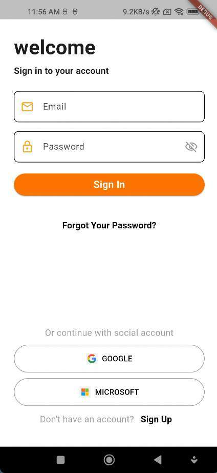
  &nbsp;&nbsp;
  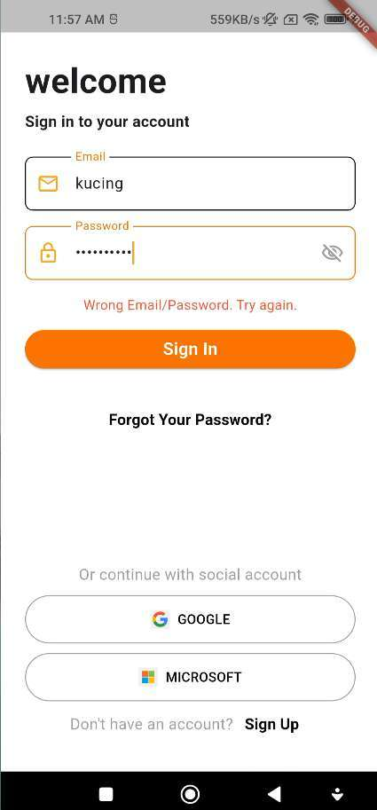

  The initial page for users to enter the application. Supports login via email, Google, and Microsoft.

🏠 Home Page

  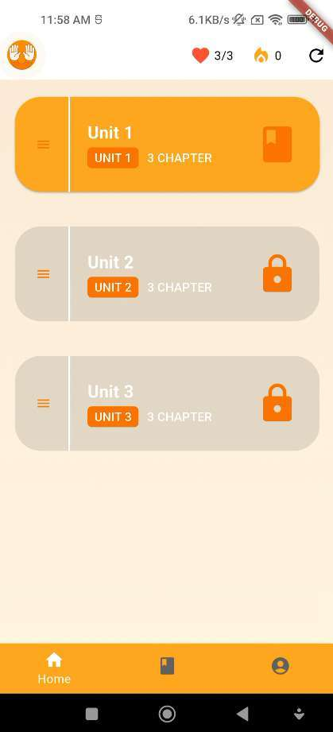
  &nbsp;&nbsp;
  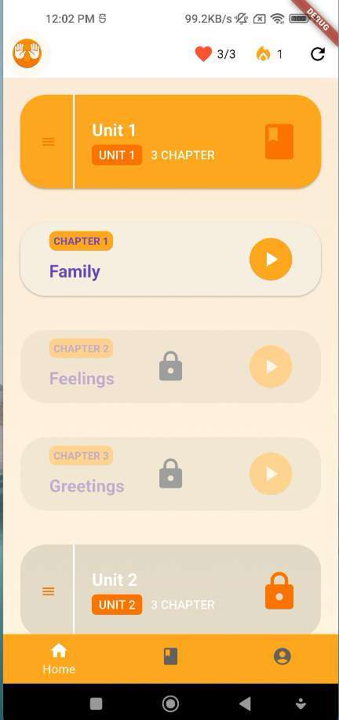

  Users are greeted with learning units. Each unit contains chapters with thematic learning videos.

🎬 Video Tutorial Page

  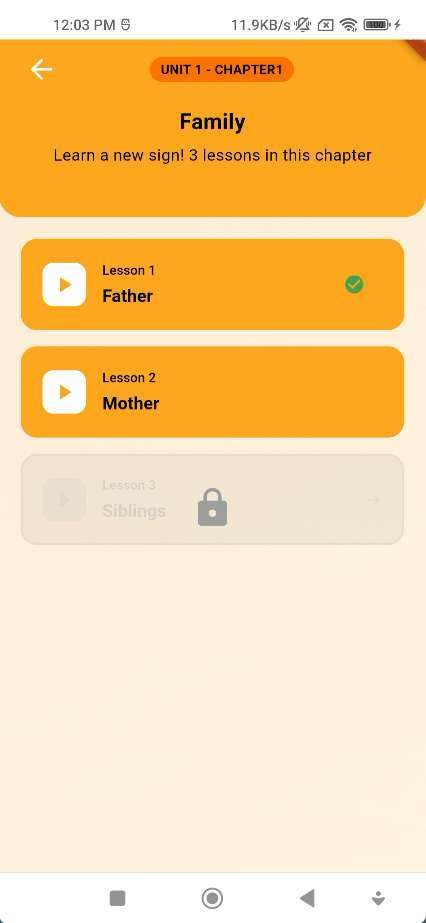
  &nbsp;&nbsp;
  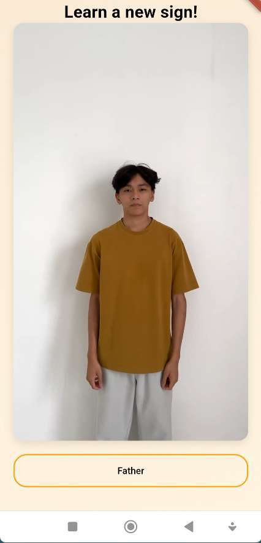

  Displays sign language learning videos. New lessons unlock only after the previous lesson is completed.

📝 Quiz Page

  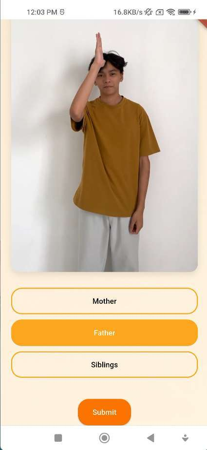
  &nbsp;&nbsp;
  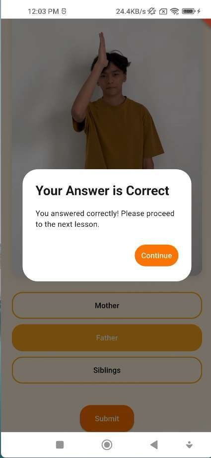
  &nbsp;&nbsp;
  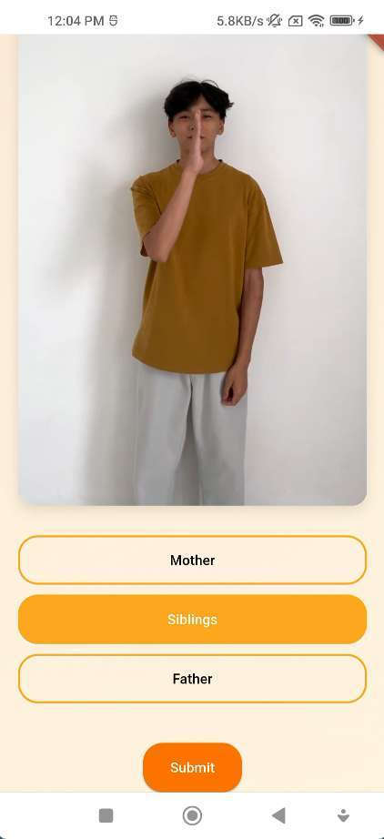

  Multiple-choice quiz at the end of each lesson. Wrong answers will reduce the user's HP.

  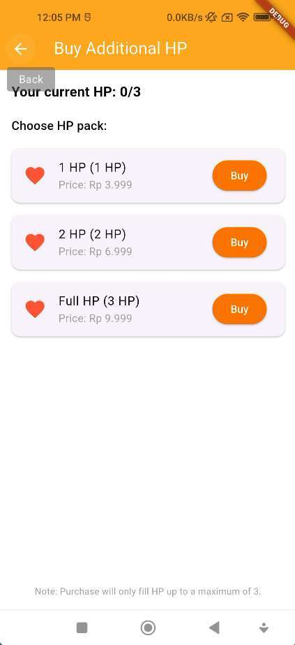

  If HP runs out, users can purchase additional HP to continue learning.

📚 Dictionary Page

  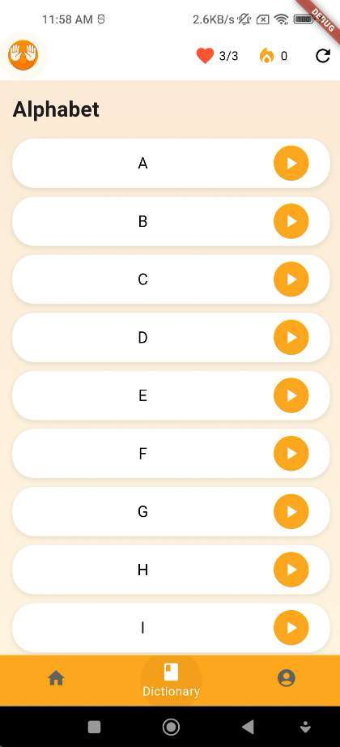
  &nbsp;&nbsp;
  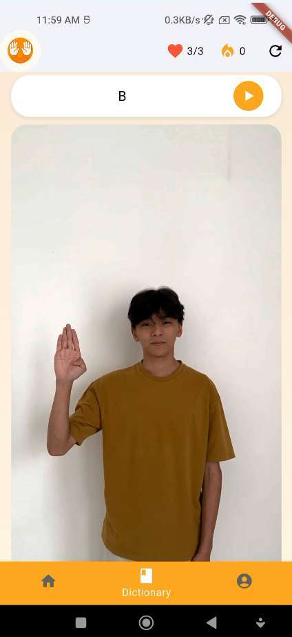

  An A–Z sign language dictionary with short videos for each letter as a quick visual reference.

👤 Profile Page

  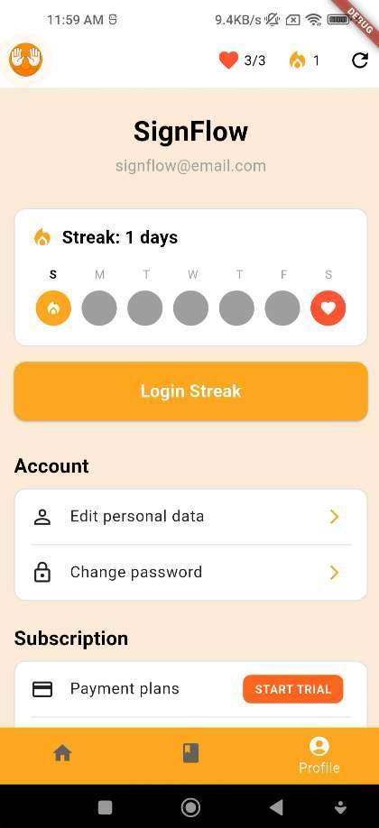
  &nbsp;&nbsp;
  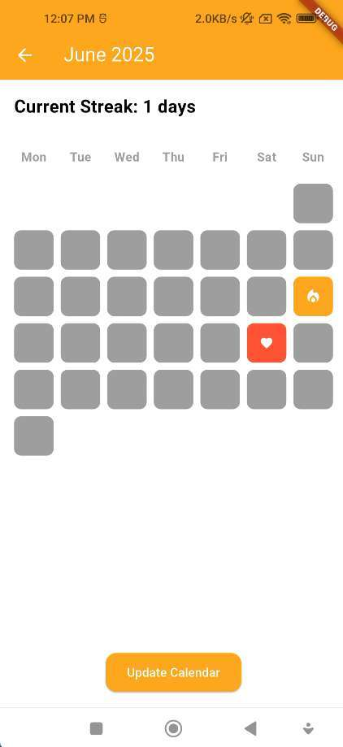
  &nbsp;&nbsp;
  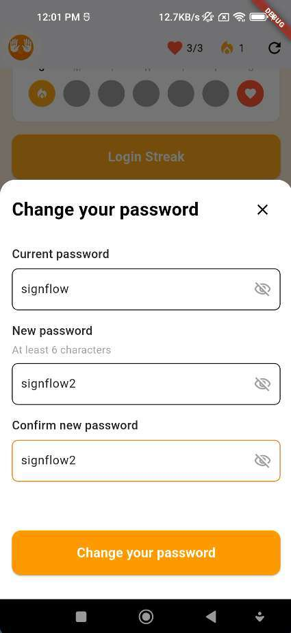

  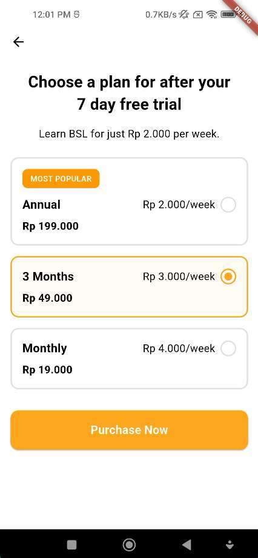
  &nbsp;&nbsp;
  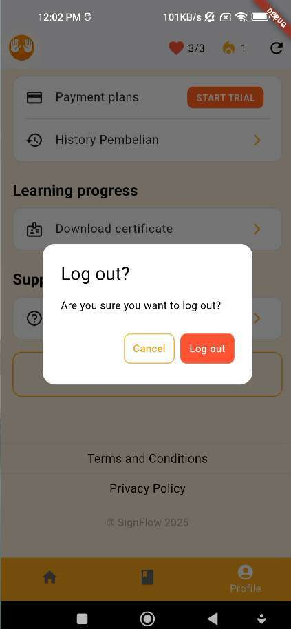

  Profile page featuring daily streak, personal data editing, subscriptions (3 types), certificates, and Help & Support.

🛠️ Technologies
<table>
  <tr>
    <th align="center">Technology</th>
    <th align="center">Purpose</th>
  </tr>
  <tr>
    <td align="center"><b>Flutter</b></td>
    <td>Interactive UI design, page navigation, animations & media, cross-platform support, plugin integration</td>
  </tr>
  <tr>
    <td align="center"><b>Firebase Authentication</b></td>
    <td>Login/Sign Up via email, Google, and Microsoft</td>
  </tr>
  <tr>
    <td align="center"><b>Cloud Firestore</b></td>
    <td>Storing learning progress, quiz results, streaks, and user preferences</td>
  </tr>
  <tr>
    <td align="center"><b>Firebase Storage</b></td>
    <td>Storage and streaming of sign language learning videos</td>
  </tr>
</table>

⚙️ Prerequisites
Before running this project, make sure you have installed:

Flutter SDK (latest stable version)
Dart SDK (included with Flutter)
Android Studio or VS Code with the Flutter extension
A Firebase account for backend configuration

🚀 Installation Guide
1. Clone the repository
bashgit clone https://github.com/abeliooo/SignFlow.git
cd SignFlow
2. Install dependencies
bashflutter pub get
3. Configure Firebase

Create a project in the Firebase Console
Download the google-services.json file and place it in the android/app/ folder
Enable Firebase Authentication, Firestore, and Storage

4. Run the application
bashflutter run

<b>ℹ️ Developer Notes (Click to expand)</b>

 
This repository contains 2 versions of the application:
FolderDescriptionwithGoogleSignInFull version with Google & Microsoft login support (requires OAuth configuration)justLocalVersion that uses only a dummy email for local testing
Debug Feature (Reset Button):

A reset button is available in the top-right corner for debugging purposes. This button can reset:

User lesson progress
Daily streak
HP (Health Point)

👥 Development Team

  This project was developed by <b>Group 10</b> — AOL Software Engineering

<table align="center">
  <tr>
    <th>NIM</th>
    <th>Name</th>
  </tr>
  <tr>
    <td>2702225612</td>
    <td>Albert Tandy Harison</td>
  </tr>
  <tr>
    <td>2702225846</td>
    <td>Calvin Suharjono</td>
  </tr>
  <tr>
    <td>2702253793</td>
    <td>Lucky Sean Marulin</td>
  </tr>
  <tr>
    <td>2702210485</td>
    <td>Ringo Gary Buntino</td>
  </tr>
  <tr>
    <td>2702302271</td>
    <td>Stefanus Abel Fillio</td>
  </tr>
</table>

  Made with ❤️ for a more inclusive world

